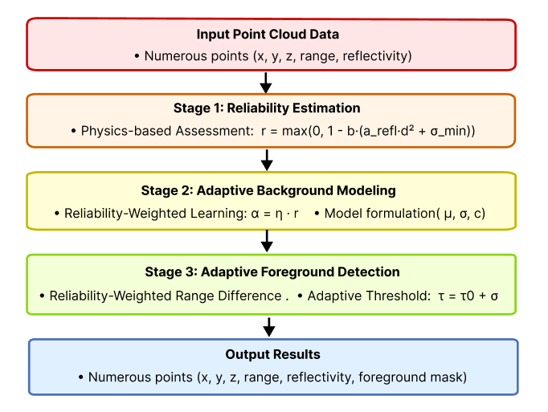
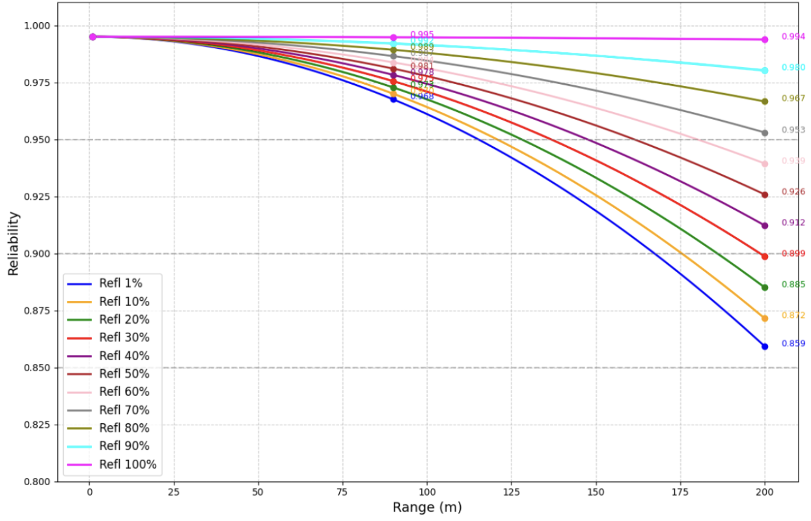
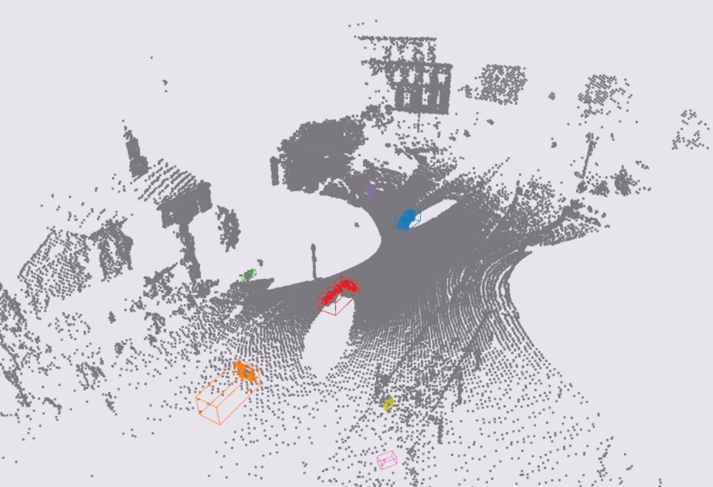

# FRGB3D

**Fast Reliability-Weighted Gaussian Background Modeling for Roadside LiDAR Traffic Monitoring**

[](https://doi.org/10.1061/JCCEE5/CPENG-7710)
[](LICENSE)

FRGB3D is an unsupervised, training-free method for background modeling and
foreground (vehicle/pedestrian) detection in roadside LiDAR point clouds. It
explicitly models per-point measurement reliability from range and
reflectivity, and uses that reliability to weight both background learning
and foreground thresholding -- improving spatial localization accuracy
without requiring labeled data or a GPU.

<p align="center">
  
</p>

## Method

FRGB3D has three components (see the paper for full derivations and
pseudocode):

1. **Physics-based point reliability estimation** -- a range- and
   reflectivity-dependent precision model converts each LiDAR return into a
   reliability score `r(p) in [0, 1]`.
2. **Reliability-weighted adaptive Gaussian background modeling** -- each
   spatial bin maintains a running mean/variance updated with a
   reliability-scaled learning rate, so noisy (low-reliability) points
   influence the background model less than clean ones.
3. **Reliability-weighted adaptive foreground detection** -- foreground
   points are flagged using a reliability-weighted deviation from the
   background model and an adaptive threshold.

<p align="center">
  
</p>

FRGB3D is compared against three baselines re-implemented in this repo:
Simple Difference (SD), Moving Average (MA), and a standard, non-reliability-weighted
Gaussian Background Model (GBM). Real-world object-level results (clustering +
bounding-box generation on top of the detected foreground) look like this:

<p align="center">
  
</p>

## Results

- **Simulation** (CARLA, base / adverse-weather / high-density scenarios):
  point-level F1 of 0.84 / 0.68 / 0.77, consistently outperforming SD, MA,
  and standard GBM.
- **Real-world** (dual Ouster OS1-128 deployment, Lowell, MA): object-level
  AP@0.1 / AP@0.3 / AP@0.5 of 0.6454 / 0.6288 / 0.4802, with the largest gain
  over standard GBM at the strictest threshold (AP@0.5: +3.86 points).
- **Throughput**: 19.1 FPS on a CPU-only Python/Numba implementation
  (Intel i9-13900K), meeting real-time requirements for 10 Hz roadside LiDAR.

See the paper for the full comparison tables and ablations.

## Repository structure

```
FRGB3D/
├── src/
│   ├── frgb3d/           # Core algorithm: reliability model, background modeling, baselines
│   │   ├── background_model.py   # FRGB3D reliability model + background modeling/detection
│   │   └── baselines.py          # SD / MA / GBM baselines
│   ├── detection/        # Object-level post-processing: clustering.py (reliability-weighted
│   │                     # density-adaptive clustering), classifying.py, compute_bbox.py
│   ├── preprocessing/    # Point cloud registration, time alignment, PCAP conversion
│   └── utils/            # I/O and visualization helpers
├── scripts/
│   ├── evaluate_simulation_metrics.py   # Point-level F1 evaluation on CARLA data
│   ├── run_realworld_preprocessing.py   # Dual-sensor FRGB3D background removal + fusion
│   ├── relabel_realworld_baseline.py    # Swap in an SD/MA/GBM foreground mask for comparison
│   ├── run_realworld_detection.py       # Clustering + bounding-box generation
│   ├── evaluate_detection_ap.py         # Object-level AP@IoU evaluation
│   ├── visualize_reliability.py         # Reproduce the reliability-vs-range figure
│   ├── carla_collect.py, carla_find.py  # CARLA simulation data collection
│   ├── visualize_carla_sequence.py      # Inspect collected simulation data
│   └── data_preparation/                # PCAP -> bin, registration, time alignment, labeling prep
└── assets/                              # Figures used in this README
```

## Installation

```bash
git clone https://github.com/siyuanmengmax/FRGB3D.git
cd FRGB3D
pip install -r requirements.txt
```

CARLA data collection (`scripts/carla_collect.py`, `scripts/carla_find.py`)
additionally requires a running [CARLA simulator](https://carla.org/) (tested
against 0.9.15) and its Python API. PCAP conversion requires the
[Ouster Python SDK](https://static.ouster.dev/sdk-docs/).

## Usage

### 1. Simulation experiments (no real sensor required)

Generate simulation data with CARLA (or bring your own semantic-LiDAR .bin
frames with an 8th `semantic_id` column), then evaluate point-level
foreground detection:

```bash
python scripts/carla_collect.py   # requires a running CARLA server

python scripts/evaluate_simulation_metrics.py \
    --method frgb3d \
    --source_pcd_folder_path data/simulation/base_scenario \
    --output_folder_path results/base_scenario_frgb3d \
    --save_summary
```

Swap `--method` between `frgb3d`, `sd`, `ma`, and `gbm` to reproduce the
baseline comparison.

### 2. Real-world experiments (dual-LiDAR deployment)

```bash
# Convert raw PCAP captures to per-frame .bin point clouds
python scripts/data_preparation/pcap_to_bin_one.py --pcap_file_path <sensor1.pcap> --json_file_path <sensor1.json>
python scripts/data_preparation/pcap_to_bin_two.py --pcap_file_path <sensor2.pcap> --json_file_path <sensor2.json>

# Time-align the two sensors' frame sequences
python scripts/data_preparation/time_alignment.py

# Register the two sensors into a common ground/coordinate frame
python scripts/data_preparation/registration.py

# Build the FRGB3D background model and fuse the two sensors
python scripts/run_realworld_preprocessing.py

# Cluster foreground points into objects and fit bounding boxes
python scripts/run_realworld_detection.py --input_folder bin/merge_label --output_folder results/realworld

# Evaluate object-level AP against annotated ground truth
python scripts/evaluate_detection_ap.py \
    --groundtruth_json <path_to_labels.json> \
    --detection_csv results/realworld/bboxes.csv \
    --iou_threshold 0.3
```

To reproduce a baseline row (SD/MA/GBM) instead of FRGB3D, run
`scripts/relabel_realworld_baseline.py --method gbm` on the fused point
clouds before `run_realworld_detection.py`.

> The exact clustering/classification hyperparameters used to reproduce the
> specific numbers in the paper's Table 4 were not all preserved in the
> original experiment logs; the defaults in `run_realworld_detection.py`
> are the best-available reconstruction. If you need bit-exact reproduction,
> please open an issue.

## Data

The full raw dataset (LiDAR PCAP captures and CARLA simulation frames) is
several hundred GB and is not hosted in this repository. A curated benchmark
subset -- the 1000-frame, manually annotated real-world evaluation set used
to compute the real-world AP numbers above -- is available at: **[Zenodo
link -- to be added]**. Full raw data is available from the authors upon
reasonable request.

## Citation

If you use this code or method, please cite:

```bibtex
@article{meng_frgb3d,
  title   = {{FRGB3D}: Fast Reliability-Weighted Gaussian Background Modeling for Roadside {LiDAR} Traffic Monitoring},
  author  = {Meng, Siyuan and Parashar, Pravar and Yang, Yu-Min and Ai, Chengbo},
  journal = {Journal of Computing in Civil Engineering},
  year    = {2026},
  publisher = {ASCE},
  doi     = {10.1061/JCCEE5/CPENG-7710},
}
```

## License

This project is licensed under the [MIT License](LICENSE).
